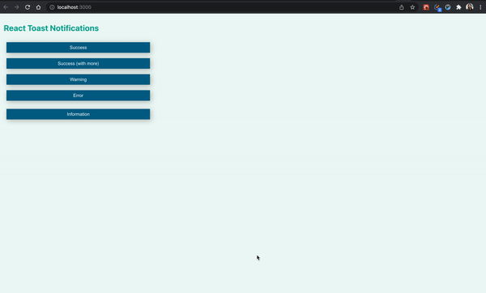

# Notification Service Demo

 

## Features

This notification service is built with react and no external library as part of SoSafe case study with following features -

- Stylized notifications types - 
    Info | Warning | Error | Success
- Stacked notifications - multiple notifications can be shown up at the same time
- Different buttons to trigger each type of API
- Autohide notifications

## Scripts

In the project directory, you can run:

#### `npm start`

Runs the app in the development mode.\
Open [http://localhost:3000](http://localhost:3000) to view it in your browser.
